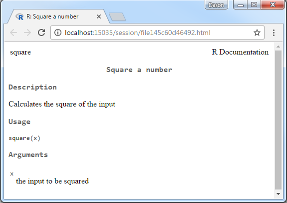
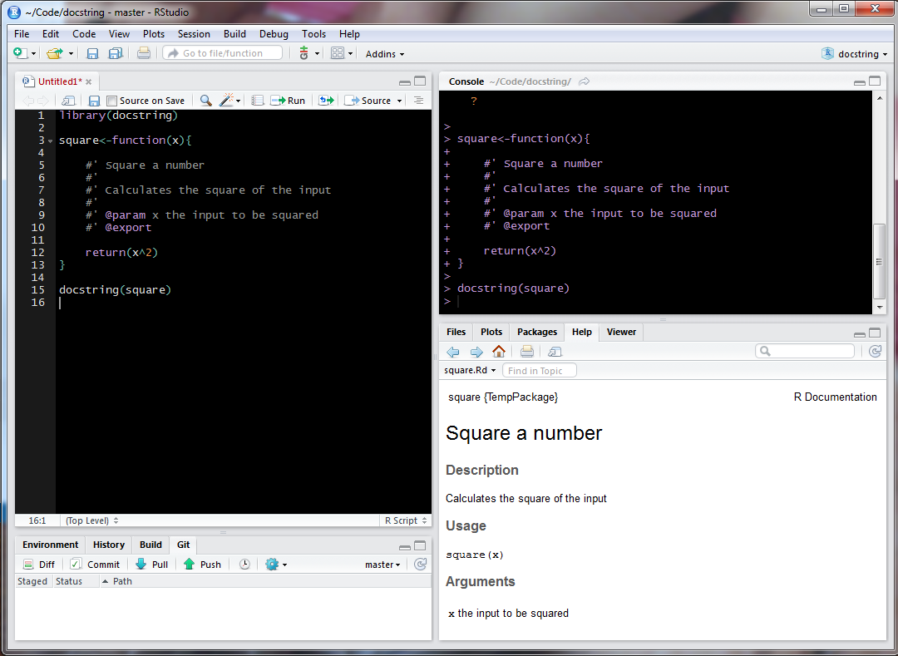
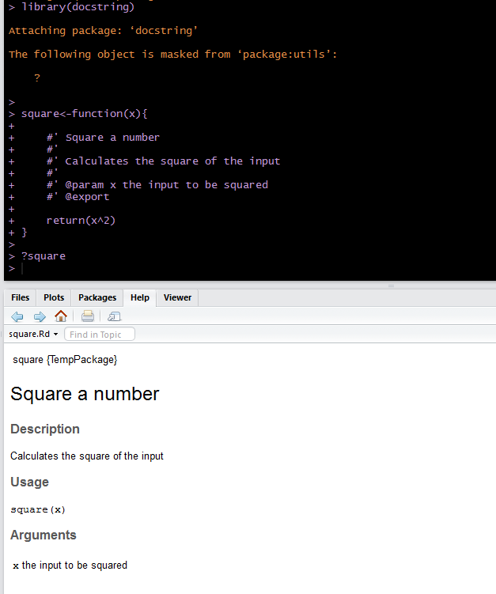

# docstring

The docstring package is an R package that provides the ability to 
display something analagous to
Python's docstrings within R.  By allowing the user to document
their functions as comments at the beginning of their function
without requiring putting the function into a package we allow
more users to easily provide documentation for their functions.
The documentation can be viewed using an accessor function but
displays just like any other R help files.

The user will need to be familiar with roxygen style comments (via the roxygen2 package)
to fully utilize the package.  Eventually I want to detect basic comments and
allow the user to just use those as the documentation without requiring
the use of the roxygen keywords at least for simple cases.  Ideally this will
allow users not yet comfortable with package creation to still provide
documentation for their functions. If they use the roxygen style comments when it
is time to convert their work into a package all they will need to do is move
their pre-existing documentation outside of the function and they will be set.

## Examples

```r
library(docstring)

square <- function(x){

    #' Square a number
    #'
    #' Calculates the square of the input
    #'
    #' @param x the input to be squared

    return(x^2)
}

docstring(square)
```



If you are running R through RStudio there is support for displaying the
docstring within the RStudio help pane directly.  This is enabled by default. It
should detect that you're running RStudio and unless you choose the `rstudio_pane=FALSE`
within `docstring` or set `options("docstring_rstudio_help_pane" = FALSE)` (which
will disable the help pane support and instead display the help in a web browser)
the docstring will show in the help pane. This isn't 100% reliable as I believe there
is a race condition going on under the hood so sometimes it doesn't show. I'm working on that.



There is also support for using `?` to access the docstring.  This will only
work for functions that 1) have a docstring contained in them and 2) are living
in the global namespace.  If it doesn't meet those requirements then `?` will 
fall back to the "typical" way that `?` would get interpreted.

For example if I defined

```r
lm <- function(){
    print("lm")
}
```

this would not meet the first condition and even though it meets the second
`?lm` would show the help file for `stats::lm` instead of saying there is no help
available.  If you included some docstring like so

```r
lm <- function(){
    #' lm docstring
    #'
    #' More docstring for lm
    print("lm")
}
```
then `?lm` will show the docstring for this function. If you wanted to view
the help for the 'typical' `lm` you would need to either use `help` directly or
specify the namespace when using `?` (i.e. `?stats::lm`)

Here is an example of the simple case where it works (shown in RStudio):




## Known Issues

 - sos
    - Both sos and docstring overwrite `?`.  In docstring `?` becomes
    a wrapper for `docstring` and in sos `?` calls `findFn`. The
    order which you load sos and docstring determines which version of `?` gets
    called if you aren't explicit about the namespace.
    - Really I'm not too worried about this since I don't see both packages
    being used in conjuction too often.  But I see both packages as providing
    useful functionality for an `interactive()` session and not being used
    within a script often.  Because of this hopefully the user will be able
    to sort out any issues that may arise from the conflicts that can happen
    by having more than one package mask a function.
    


## Installation

The package is not yet on CRAN but is available to download using devtools.

You can also download the dev version via [zip ball](https://github.com/dasonk/docstring/zipball/master) or [tar ball](https://github.com/dasonk/docstring/tarball/master), decompress and run `R CMD INSTALL` on it, or use the **devtools** package to install the development version:

```r
## Make sure your current packages are up to date
update.packages()
## devtools is required
library(devtools)
install_github("dasonk/docstring")
```

Note: Windows users need [Rtools](http://www.murdoch-sutherland.com/Rtools/) and [devtools](http://CRAN.R-project.org/package=devtools) to install this way.


## Contact

You are welcome to:
* submit suggestions and bug-reports at: <https://github.com/dasonk/docstring/issues>
* send a pull request on: <https://github.com/dasonk/docstring/>


