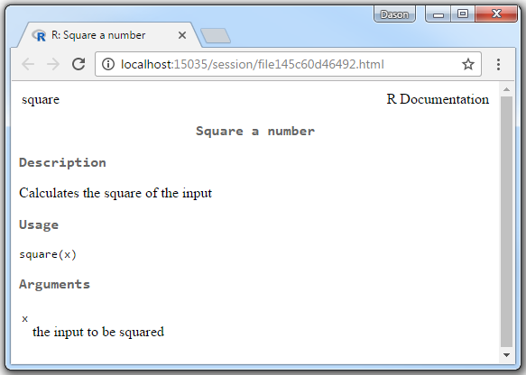
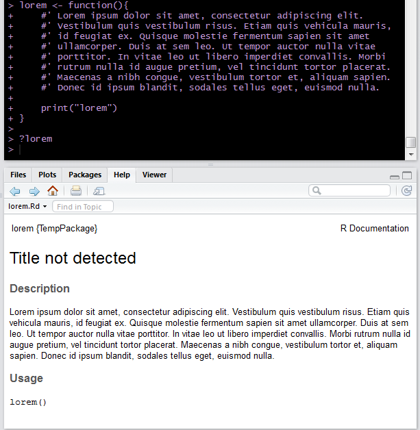
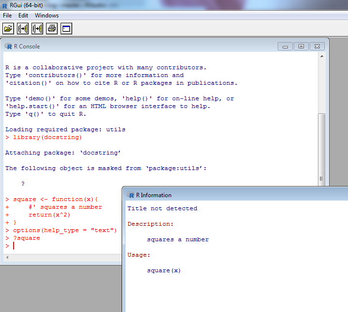

# docstring

The docstring package is an R package that provides the ability to 
display something analagous to
Python's docstrings within R.  By allowing the user to document
their functions as comments at the beginning of their function
without requiring putting the function into a package we allow
more users to easily provide documentation for their functions.
The documentation can be viewed using an accessor function but
displays just like any other R help files.

The user will need to be familiar with roxygen style comments (via the [roxygen2 package](https://cran.r-project.org/package=roxygen2))
to fully utilize the package.  

Ideally this will
allow users not yet comfortable with package creation to still provide
documentation for their functions. If they use the roxygen style comments when it
is time to convert their work into a package all they will need to do is move
their pre-existing documentation outside of the function and they will be set.

## Examples


```r
library(docstring)

square <- function(x){

    #' Square a number
    #'
    #' Calculates the square of the input
    #'
    #' @param x the input to be squared

    return(x^2)
}

docstring(square)
# or
?square
```



### R Studio support

If you are running R through RStudio there is support for displaying the
docstring within the RStudio help pane directly.  This is enabled by default. It
should detect that you're running RStudio and unless you choose the `rstudio_pane=FALSE`
within `docstring` or set `options("docstring_rstudio_help_pane" = FALSE)` the help
will display in the RStudio help pane. If you disable the help pane support then
the help will instead display in a web browser.


There is also support for using `?` to access the docstring.  


### Single Chunks

One does not need to adhere completely to the roxygen style for documentation.
One notable exception is when the docstring is just a single chunk of
text with no blank lines or @keywords.  In these cases it is assumed that
the text is supposed to be interpreted as the "Description" section of the 
help file and the generated help page adheres to that assumption.



Currently if there are any roxygen style comments that are "blank"

```r
#' This is a roxygen style comment
#' and the following line is considered "blank"
#'
#' because the leading #' doesn't count
```

or if any lines start with "keywords" (such as @param, @export, ...)
then the automation to give it the default title and put the single chunk
in the "Description" section is not applied as it is
assumed that the user is adhering to the full roxygen standard.

### ? support

A little bit more information on `?` support. 
This will only work for functions that:

 1) have a docstring contained in them and 
 2) are living in the global environment.  

If it doesn't meet those requirements then `?` will fall back to the "typical" 
way that `?` would get interpreted.

For example if I defined

```r
lm <- function(){
    print("lm")
}
```

this would not meet the first condition and even though it meets the second
`?lm` would show the help file for `stats::lm` instead of saying there is no help
available.  If you included some docstring like so

```r
lm <- function(){
    #' lm docstring
    #'
    #' More docstring for lm
    print("lm")
}
```
then `?lm` will show the docstring for this function. If you wanted to view
the help for the 'typical' `lm` you would need to either use `help` directly or
specify the namespace when using `?` (i.e. `?stats::lm`)


### help_type

Currently "html" and "text" are supported help types. The help_type "pdf" is
not supported.  If RStudio is running then the RStudio help pane will also be
used regardless of what the help_type is set to unless options are specified to 
not use the help pane.



## Known Issues

 - sos
    - Both sos and docstring overwrite `?`.  In docstring `?` becomes
    a wrapper for `docstring` and in sos `?` calls `findFn`. The
    order which you load sos and docstring determines which version of `?` gets
    called if you aren't explicit about the namespace.
    - Really I'm not too worried about this since I don't see both packages
    being used in conjuction too often.  But I see both packages as providing
    useful functionality for an `interactive()` session and not being used
    within a script often.  Because of this hopefully the user will be able
    to sort out any issues that may arise from the conflicts that can happen
    by having more than one package mask a function.
 - devtools
    - devtools (actually pkgload which is used by devtools) creates a drop-in 
    replacement for `?` and `help` when using `load_all()`. The `?` and `help`
    replacements are only attached after `load_all()` is called. So if you use
    devtools without using `load_all()` you'll never see a conflict with 
    `docstring`.  However if you do use `load_all()` after you've loaded
    `docstring` then you might need to use the `docstring()` function to access
    your help files.
    - One possible workaround would be to include a "devtools_shims" in `search()`
    if the user doesn't want to have the devtools version loaded. By doing this
    the check that pkgload does to see if it should add `?` and `help` functionality
    will come back as `FALSE`.  This would probably need to be added into docstring
    as a package option that defaults to not overwritting the devtools stuff.
    It's a headache all around but I shouldn't create even more unexpected behavior
    without the user specifying that it's what they want to do.


## Installation

The package is not yet on CRAN but is available to download using devtools.

You can also download the dev version via [zip ball](https://github.com/dasonk/docstring/zipball/master) or [tar ball](https://github.com/dasonk/docstring/tarball/master), decompress and run `R CMD INSTALL` on it, or use the **devtools** package to install the development version:

```r
## Make sure your current packages are up to date
update.packages()
## devtools is required
library(devtools)
install_github("dasonk/docstring")
```

Note: Windows users need [Rtools](http://www.murdoch-sutherland.com/Rtools/) and [devtools](http://CRAN.R-project.org/package=devtools) to install this way.


## Contact

You are welcome to:
* submit suggestions and bug-reports at: <https://github.com/dasonk/docstring/issues>
* send a pull request on: <https://github.com/dasonk/docstring/>


